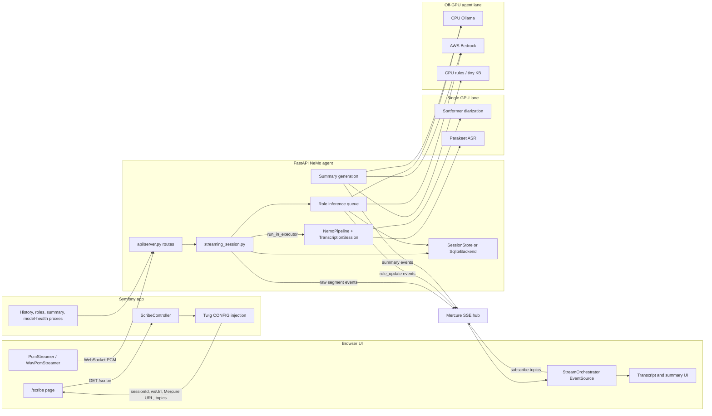
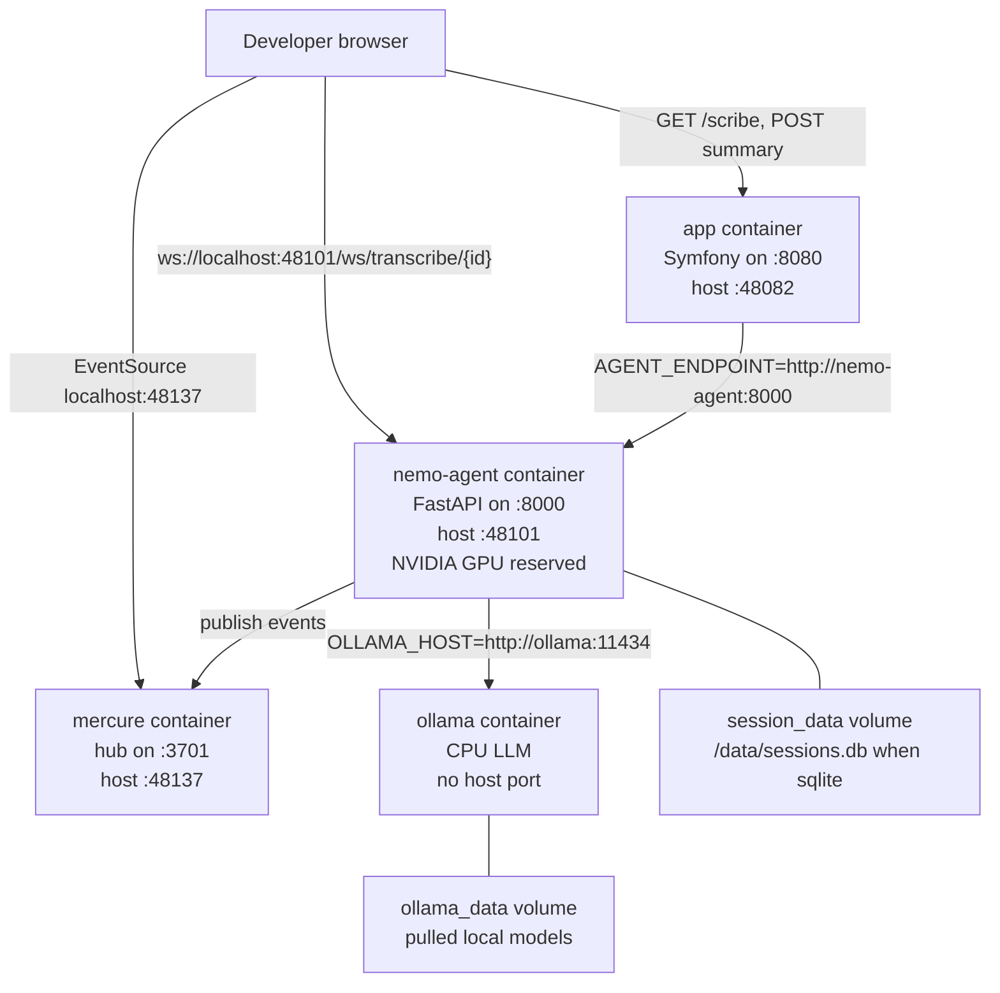
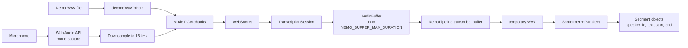
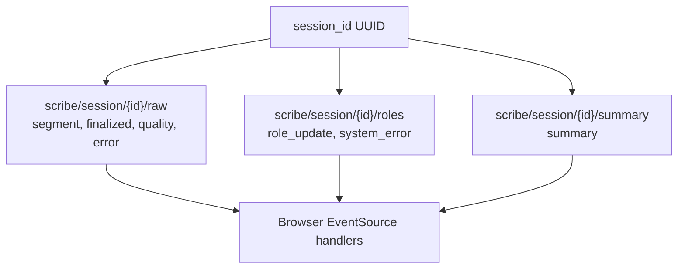
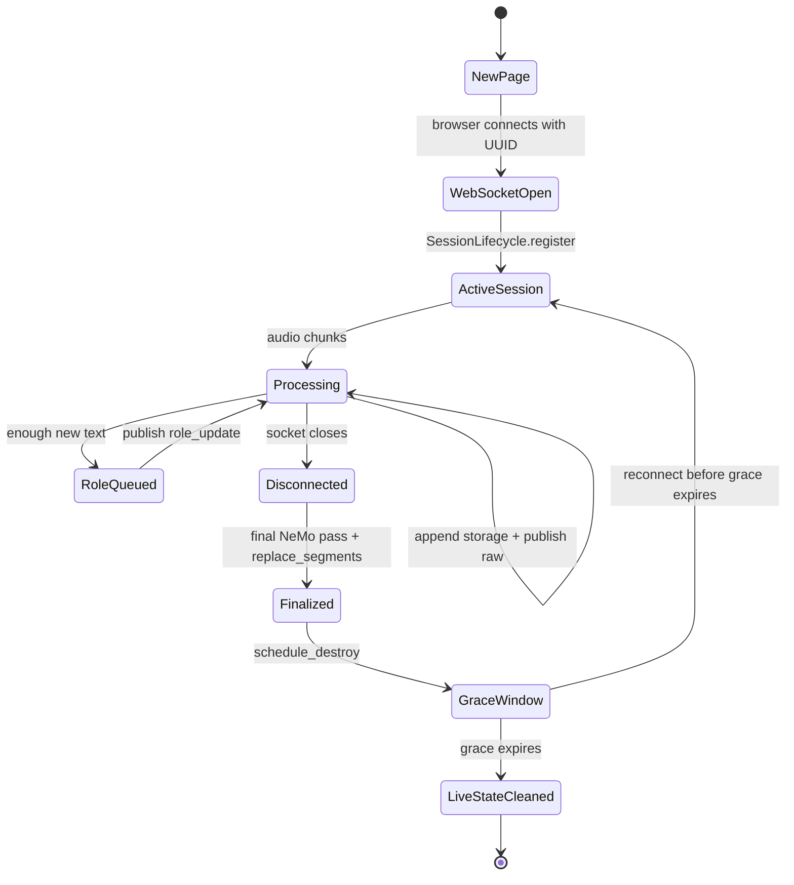
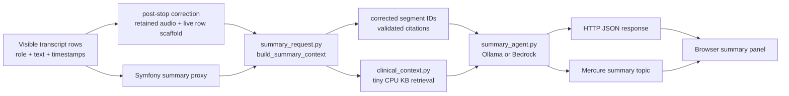

# How Ambient Scribe Works

Checked against this checkout on 2026-07-07.

Ambient Scribe is a Symfony + FastAPI + NeMo + Strands + Mercure medical transcription app. A clinician opens a Symfony-rendered page, the browser streams 16 kHz PCM audio directly to FastAPI over WebSocket, FastAPI runs NeMo on the single GPU, and Mercure streams transcript events back to the browser. Role labels, summaries, clinical context retrieval, and medical text cleanup are deliberately kept off the NeMo GPU.

The core invariant:

```text
NeMo owns the single NVIDIA GPU.
Role inference, summaries, clinical context retrieval, and medical term correction never use that GPU.
```

## Mental Model

Think of the system as three cooperating lanes:

- Browser lane: captures audio, sends PCM chunks, subscribes to Mercure, renders transcript cards, replays demo WAVs, and requests summaries.
- Symfony lane: serves `/scribe`, generates the session UUID, injects browser-facing config, and proxies same-origin helper requests for summary, history, role snapshots, and model health.
- FastAPI lane: owns WebSocket audio ingest, NeMo inference, transcript storage, role inference queues, summaries, health, and Mercure publishing.



## Runtime Services

Local Docker Compose runs four services:

| Service | Default local access | Responsibility |
| --- | --- | --- |
| `app` | `http://localhost:48082` | Symfony UI, Twig config injection, same-origin proxy routes |
| `nemo-agent` | `http://localhost:48101` | FastAPI WebSocket and HTTP API, NeMo, storage, agents, Mercure publishing |
| `mercure` | `http://localhost:48137/.well-known/mercure` | Browser-facing SSE fan-out |
| `ollama` | Docker network only, `http://ollama:11434` | CPU-only local model provider when selected |



## Live Transcription Flow

The hot path is browser to FastAPI to Mercure. PHP does not process live audio frames.

```mermaid
sequenceDiagram
    participant B as Browser
    participant P as Symfony
    participant A as FastAPI
    participant N as NeMo executor
    participant S as Transcript storage
    participant R as Role queue
    participant L as Ollama or Bedrock
    participant M as Mercure

    B->>P: GET /scribe
    P-->>B: HTML + CONFIG(sessionId, wsUrl, Mercure URL, topics)
    B->>A: WebSocket /ws/transcribe/{session_id}
    A->>A: Validate UUID; resume or create TranscriptionSession
    B->>M: EventSource subscribe to raw, roles, summary

    loop Audio chunks
        B->>A: 16 kHz mono s16le PCM ArrayBuffer
        A->>N: session.process_chunk(audio) via nemo_executor
        N-->>A: raw spk_* segments
        A->>S: append_segment(session_id, segment)
        A->>M: publish raw segment
        M-->>B: raw segment event
        A->>R: enqueue new segments
        R->>L: infer speaker -> role off the GPU
        L-->>R: mapping, confidence, or fallback
        R->>S: apply_role_mapping(session_id, mapping)
        R->>M: publish role_update
        M-->>B: role_update event
        B->>B: relabel visible transcript cards
    end

    B->>A: Close WebSocket on stop
    A->>N: session.finalize() via nemo_executor
    N-->>A: final transcript
    A->>S: replace_segments(session_id, final transcript)
    A->>M: publish finalized
    M-->>B: finalized event

    B->>P: POST /session/{id}/correction
    P->>A: POST /session/{id}/correction
    A->>N: second-pass ASR over retained audio
    N-->>A: corrected rows (stored separately)

    B->>P: POST /session/{id}/summary with visible segments
    P->>A: POST /session/{id}/summary
    A->>L: generate SOAP summary off the GPU (prefers corrected rows)
    A->>M: publish summary
    A-->>P: summary JSON
    P-->>B: summary JSON
```

## Transcription Engines

Live transcription runs one of two engines, selected process-wide by
`NEMO_SESSION_ENGINE`:

- `windowed` (Compose and `.env.example` default): `TranscriptionSession` in
  `nemo_session.py` re-transcribes each emission window past a high-water mark
  and stitches speaker IDs across window seams.
- `streaming` (M22, `scripts/start-dev.sh` default for daily dev):
  `StreamingSessionEngine` in `nemo_streaming_engine.py` wraps NVIDIA's
  SpeakerTaggedASR composite so one session-long Sortformer speaker cache owns
  speaker identity for the whole visit, removing the window-seam identity swaps.

Rollback is an env flip plus an agent restart. Both engines share the same
WebSocket, storage, role inference, and Mercure paths described below.

## Audio Path

The current browser/server contract is raw PCM:

- Browser microphone capture uses Web Audio, downsampling to 16 kHz mono, signed 16-bit PCM.
- Demo WAV replay is decoded in the browser, converted to the same PCM shape, and paced by the audible replay clock.
- FastAPI expects `NEMO_STREAM_INPUT_FORMAT=pcm` unless both browser and server are changed together.
- `TranscriptionSession` validates the first chunk so WebM or WAV headers fail early when the server expects headerless PCM.



Important files:

| Concern | Start here |
| --- | --- |
| Browser PCM and Mercure subscriptions | `public/js/scribe-streaming.js` (`PcmStreamer`, `WavPcmStreamer`, `StreamOrchestrator`) |
| Start/stop/reconnect lifecycle | `public/js/scribe-recording.js` (`startRecording`, `connectWebSocket`, `subscribeToMercure`) |
| Visible transcript cards and role relabeling | `public/js/scribe-transcript.js` (`handleRawSegment`, `handleRoleUpdate`) |
| Replay and summary UI | `public/js/scribe-output.js` (`startReplay`, `requestSummary`, `handleSummaryEvent`) |
| Post-visit actions and summary panel states | `public/js/scribe-actions.js` (`revealPostVisitActions`, `setSummaryPendingText`) |
| WebSocket route | `strands_agents/api/server.py` (`transcribe_stream`) |
| Streaming workflow | `strands_agents/api/streaming_session.py` (`transcribe_stream_session`) |
| Per-session audio buffer | `strands_agents/nemo_session.py` (`TranscriptionSession`) |
| Shared GPU pipeline | `strands_agents/nemo_pipeline.py` (`NemoPipeline`) |

## Mercure Topics

Every session uses sibling topics under one UUID. These topics separate latency and failure domains: raw transcript should appear quickly, role labels can arrive later, and summaries happen after the visit.



Topic producers:

- Raw events come from `streaming_session.py` after each NeMo pass and on finalization.
- Role events come from `role_inference_queue.py` after the off-GPU agent or heuristic fallback updates the speaker mapping.
- Summary events come from `summary_request.py` after `/session/{id}/summary`.
- Publishing is centralized in `api/mercure_publisher.py`, using `MERCURE_JWT` or an HS256 token derived from `MERCURE_JWT_SECRET`.

Mercure is not durable storage. It is the browser event fan-out. Transcript history lives in the configured storage backend.

## Session State And Storage

There are two related but different kinds of state:

- Live state: `SessionLifecycle` tracks active WebSocket sessions and keeps a short reconnect grace window before cleaning live audio and role state.
- Transcript history: `SessionStore` or `SqliteBackend` stores transcript segments for history, role context, and summary generation.



Storage options:

| Setting | Behavior |
| --- | --- |
| `SESSION_STORAGE=memory` | In-process `SessionStore`; local and fast, lost on process restart, TTL controlled by `SESSION_TTL_SECONDS`. |
| `SESSION_STORAGE=sqlite` | `SqliteBackend` at `SESSION_DB_PATH`; persists segments and roles across process restarts when backed by a mounted volume. |

Live cleanup does not mean Mercure has history. If a browser needs transcript history, it asks Symfony `/scribe/{sessionId}/history`, which calls FastAPI `/session/{session_id}/history`.

## Role Inference

Raw NeMo speaker labels are `spk_0`, `spk_1`, and similar. The browser shows raw labels immediately, then role inference updates them to clinical labels such as `DOCTOR` and `PATIENT`.

Role inference is intentionally asynchronous:

1. `streaming_session.py` stores and publishes raw segments first.
2. `role_inference_queue.py` batches new segment payloads per session.
3. The worker waits for at least two speakers before trying role inference.
4. `run_role_inference` in `api/role_agent_runtime.py` (imported by `api/server.py`) calls the Strands role agent off the event loop.
5. The agent is expected to call `assign_roles`, which persists mapping state and detects likely diarization flips.
6. The queue applies the mapping to storage and publishes a `role_update` event.

Fallback behavior:

- If the configured LLM provider fails, FastAPI attempts a CPU keyword heuristic.
- If the provider looks unreachable, the roles topic gets a one-time `system_error` so the browser can show a visible AI-model warning.
- Manual role overrides in the UI call the same-origin Symfony proxy `/scribe/{sessionId}/roles/override`, which forwards to FastAPI `/session/{session_id}/roles/override`; the override is stored and published back through the roles topic.

Important files:

| Concern | File |
| --- | --- |
| Role agent prompt and provider factory | `strands_agents/agents/transcription_agent.py` |
| Role state, confidence, flip detection, and tool | `strands_agents/tools/assign_roles.py` |
| Role queue and publish workflow | `strands_agents/api/role_inference_queue.py` |
| Provider failure and heuristic fallback | `strands_agents/api/role_agent_runtime.py` (`run_role_inference`) |

## Summary And Clinical Context

When a session stops and transcript text exists, the browser calls Symfony:

```text
POST /session/{sessionId}/summary
```

Symfony proxies that to FastAPI:

```text
POST /session/{session_id}/summary
```

Before the summary request, the browser asks Symfony to proxy a post-stop correction request:

```text
POST /session/{sessionId}/correction
```

Symfony proxies that to FastAPI:

```text
POST /session/{session_id}/correction
```

FastAPI uses retained session audio and the current browser-visible transcript rows as timing/role scaffolding, then stores corrected rows separately from the live preview. If correction is unavailable because audio expired or ASR fails, the browser continues with the live-preview summary instead of blocking the note.

Local QA can fetch the exact corrected artifact from FastAPI after the pass runs:

```http
GET /session/{session_id}/corrected-transcript
```

It returns the same `segments` shape as live history so `scripts/transcript-quality.py` can score the corrected rows directly. An empty `segments` array means the visit has not produced a corrected artifact yet.

The browser then sends the transcript rows it can see, including current role labels. FastAPI normalizes those rows, stores them as the selected summary context, calls the off-GPU summary agent, and publishes a summary event. When a corrected post-visit transcript exists, FastAPI prefers those corrected rows for summary generation and exposes their stable `segment_id` values as citation sources. Invalid or hallucinated citation IDs are removed before the browser receives the summary; valid citations render as source chips with the corrected row excerpt and can highlight the matching visible transcript row when that row is on screen.



Clinical context snippets are assistive only. They do not diagnose, prescribe, mutate transcript text, or block summary display.

## Configuration Precedence Worth Knowing

Several defaults exist at different layers. For model-provider docs or changes, check all of them together.

| Source | What it does |
| --- | --- |
| Python agent code | Defaults `ROLE_AGENT_MODEL_PROVIDER` to `bedrock` if the env var is missing. |
| `docker-compose.yml` | Passes `ROLE_AGENT_MODEL_PROVIDER=${ROLE_AGENT_MODEL_PROVIDER:-ollama}` to `nemo-agent`, so Compose falls back to Ollama when the variable is absent. It also pins `OLLAMA_HOST=http://ollama:11434` inside the agent container. |
| `.env.example` | Currently has an active `ROLE_AGENT_MODEL_PROVIDER=bedrock` value with Ollama settings present for switching to local CPU inference. Copying it to `.env` selects Bedrock unless you change that line. |

Other high-value env contracts:

| Env var | Consumer | Meaning |
| --- | --- | --- |
| `AGENT_ENDPOINT` | Symfony | Internal PHP-to-FastAPI base URL for proxy/helper routes. |
| `NEMO_WEBSOCKET_URL` | Browser via Twig | Browser-to-FastAPI WebSocket base URL. |
| `MERCURE_URL` | Symfony Mercure config | Internal Mercure URL for Symfony publish paths. |
| `MERCURE_PUBLIC_URL` | Browser via Twig | Browser EventSource URL. |
| `MERCURE_HUB_URL` | FastAPI | Internal FastAPI-to-Mercure publish URL. |
| `MERCURE_JWT_SECRET` / `MERCURE_JWT` | FastAPI and Mercure | Publish auth for browser-visible events. |
| `NEMO_STREAM_INPUT_FORMAT` | FastAPI | Audio contract, currently `pcm`. |
| `NEMO_SESSION_ENGINE` | FastAPI | `windowed` (Compose default) or `streaming` (M22 engine; `start-dev.sh` default). |
| `NEMO_MAX_WORKERS` | FastAPI | NeMo GPU worker pool size. |
| `SESSION_STORAGE` / `SESSION_DB_PATH` | FastAPI | Memory versus SQLite transcript storage. |
| `MEDICAL_BOOST_ENABLED` | `NemoPipeline` | Enables conservative post-ASR medical term correction, not decode-time phrase boosting. |

## What Each Layer Owns

| Layer | Owns | Does not own |
| --- | --- | --- |
| Browser | Audio capture, demo WAV replay, WebSocket send, Mercure subscribe, transcript UI, manual role correction requests, summary request body. | NeMo inference, durable transcript state, model provider selection. |
| Symfony | `/scribe` page, UUID creation, Twig config, dev audio fixture route, same-origin summary/model-health/history/roles helpers. | Live audio frames, NeMo, role queue, summary generation. |
| FastAPI | WebSocket ingest, UUID validation, NeMo executor, session lifecycle, transcript storage, role inference queue, summaries, health, Mercure publishing. | Rendering the main page, browser DOM state, PHP routing. |
| NeMo pipeline | Sortformer diarization, Parakeet ASR, optional post-ASR medical correction. | Role inference, summaries, clinical context retrieval, persistent storage. |
| Mercure | Transient SSE fan-out to subscribed browsers. | Transcript history or replayable durable state. |
| Ollama / Bedrock | Off-GPU language model calls for roles and summaries. | GPU speech recognition. |

## Failure And Recovery Paths

| Failure | User-visible behavior | Main code path |
| --- | --- | --- |
| FastAPI NeMo model load fails | `/health` reports degraded; Docker healthcheck can mark `nemo-agent` unhealthy. | `api/server.py` `health`, `nemo_pipeline.py` `load_error` |
| Mercure publish fails during live transcription | First raw publish failure sends a WebSocket `system_error`; transcript delivery is degraded. | `streaming_session.py` `_warn_live_streaming_failure` |
| Role/summary model unavailable | Browser pre-flight blocks start through `/agent/model-health`; role worker can also publish a roles-topic `system_error`. | `scribe-output.js` `ensureAiModelAvailable`, `api/server.py` `agent_model_health`, `role_inference_queue.py` |
| WebSocket drops unexpectedly | Browser auto-reconnects with exponential backoff; FastAPI keeps live state briefly during the grace window. | `scribe-recording.js` `handleUnexpectedDisconnect`, `session_lifecycle.py` |
| Summary generation fails | Symfony returns a browser-safe error; UI shows retryable summary failure while transcript remains visible. | `ScribeController::summary`, `scribe-output.js` `showSummaryFailure` |
| Demo replay backend finalization stalls | Browser drains the replay and has a timeout so the UI does not hang forever. | `scribe-output.js` `enterReplayDrain` |

## Where To Start As A New Developer

Read in this order for the main flow:

1. `src/Controller/ScribeController.php`: start with `index`, then `summary`, `history`, `roles`, and `modelHealth`.
2. `templates/scribe/index.html.twig`: look for the `CONFIG` object near the bottom; this is the browser contract Symfony injects.
3. `public/js/scribe-recording.js` and `public/js/scribe-streaming.js`: start/stop/reconnect, WebSocket setup, PCM conversion, and Mercure subscription.
4. `public/js/scribe-transcript.js`, `public/js/scribe-output.js`, and `public/js/scribe-actions.js`: raw segments, role updates, summaries, replay states, and post-visit actions.
5. `strands_agents/api/server.py`: FastAPI route table and shared service wiring.
6. `strands_agents/api/streaming_session.py`: live audio loop that stores, publishes, and queues role work.
7. `strands_agents/nemo_session.py` and `strands_agents/nemo_pipeline.py`: per-session audio buffering and the singleton GPU speech pipeline.
8. `strands_agents/api/role_inference_queue.py`, `strands_agents/agents/transcription_agent.py`, and `strands_agents/tools/assign_roles.py`: async speaker-to-role updates.
9. `strands_agents/api/summary_request.py`, `strands_agents/api/summary_generation.py`, `strands_agents/agents/summary_agent.py`, and `strands_agents/clinical_context.py`: post-visit summaries and clinical context retrieval.
10. `docker-compose.yml`, `.env.example`, and `config/packages/framework.yaml`: local ports, env propagation, browser-facing URLs, and model provider selection.

## Common Change Boundaries

Use these boundaries before editing:

| Change | Read both sides first |
| --- | --- |
| Browser audio format, chunking, or sample rate | `public/js/scribe-streaming.js`, `strands_agents/nemo_session.py`, `.env.example`, `docker-compose.yml` |
| WebSocket path or payloads | `public/js/scribe-recording.js`, `strands_agents/api/server.py`, tests under `tests/e2e/` and `tests/python/` |
| Mercure topic names or event payloads | `ScribeController::index`, `templates/scribe/index.html.twig`, `public/js/scribe-recording.js`, `public/js/scribe-transcript.js`, `public/js/scribe-output.js`, `strands_agents/api/*` publishers |
| NeMo model loading or GPU concurrency | `strands_agents/nemo_pipeline.py`, `strands_agents/api/server.py`, `docker/nemo/Dockerfile`, `docker-compose.yml` |
| Role provider/model behavior | `strands_agents/agents/transcription_agent.py`, `strands_agents/api/server.py`, `.env.example`, `docker-compose.yml`, `README_STACK.md` |
| Summary behavior | `public/js/scribe-output.js`, `src/Controller/ScribeController.php`, `strands_agents/api/summary_request.py`, `strands_agents/api/summary_generation.py`, `strands_agents/clinical_context.py` |
| Post-stop correction behavior | `public/js/scribe-output.js`, `src/Controller/ScribeController.php`, `strands_agents/api/server.py`, `strands_agents/post_visit_correction.py`, `strands_agents/corrected_role_cues.py` |
| Storage persistence | `strands_agents/session.py`, `strands_agents/storage.py`, `strands_agents/api/server.py`, `docker-compose.yml` |

## Verification Commands

For documentation-only changes, a focused proof is usually enough:

```bash
rg -n "mermaid|README_HOW_IT_WORKS|NEMO_STREAM_INPUT_FORMAT|ROLE_AGENT_MODEL_PROVIDER" README_HOW_IT_WORKS.md
git status --short -- README_HOW_IT_WORKS.md
git diff --no-index -- /dev/null README_HOW_IT_WORKS.md
```

For code or contract changes, use the project gates that match the touched lane:

```bash
composer test
composer analyse
composer cs:check
strands_agents/.venv/bin/pytest tests/python/ -q
./scripts/preflight-checks.sh
```

For local runtime confidence:

```bash
./scripts/start-dev.sh
./scripts/health-check-localdev.sh
./scripts/gpu-check.sh
./scripts/check-ai-model.sh
```
