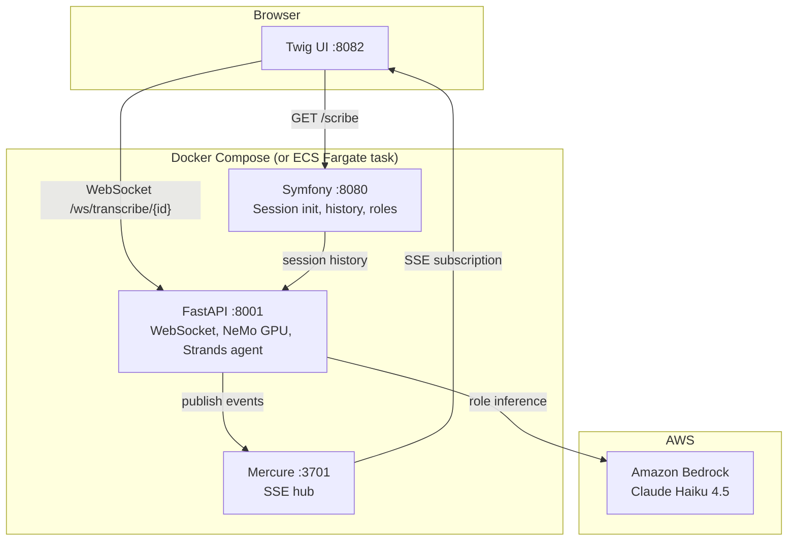
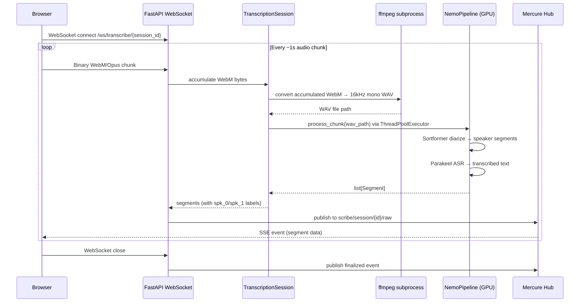
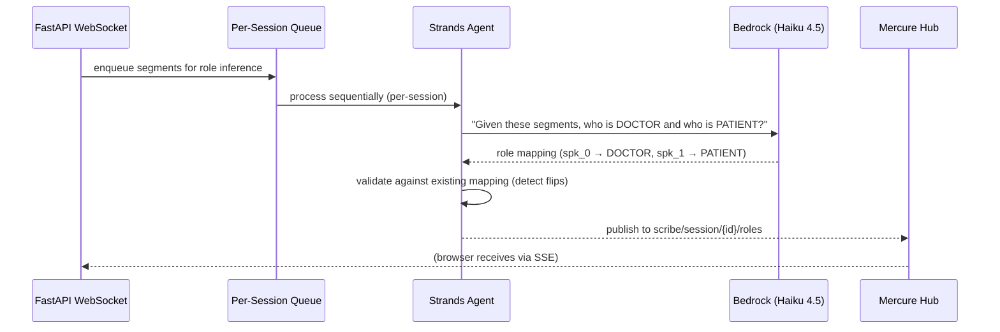
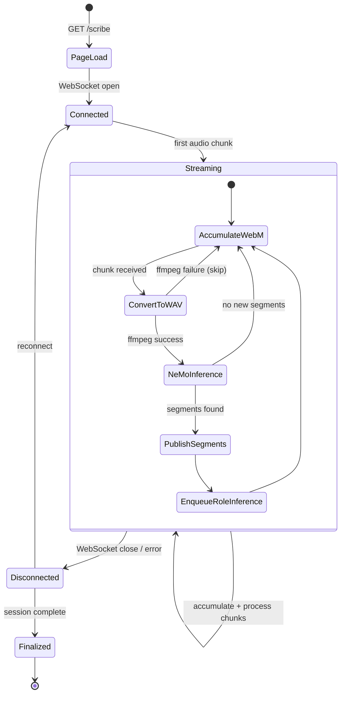
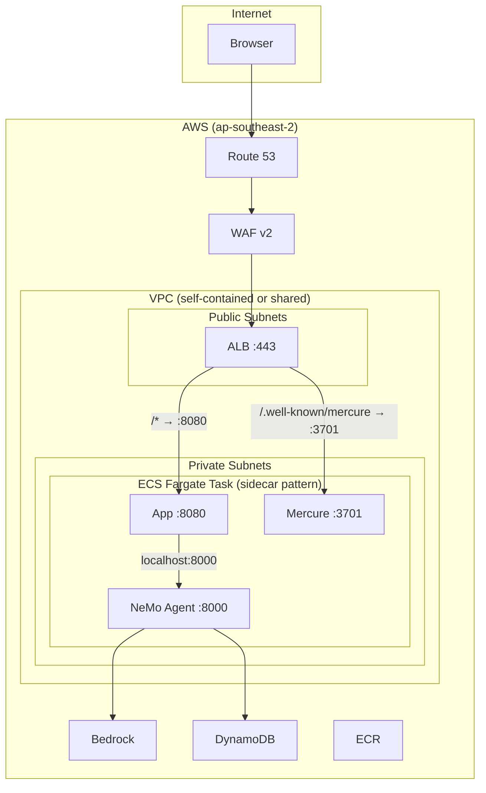

# Architecture

System design with WHY explanations. For code locations, see `docs/code-map.md`. For NeMo API details, see `docs/nemo-api-notes.md`.

## System Overview

**WHY three services?** PHP serves the initial page and manages session state — it's the right tool for server-rendered HTML with Twig. Python owns the GPU and real-time WebSocket — asyncio + NeMo is the only viable option for streaming inference. Mercure decouples publishing from subscribing so the browser gets updates without polling.

**WHY PHP does NOT touch the audio hot path?** Audio flows browser → Python via WebSocket directly. Adding PHP as a relay would double latency and add a serialization boundary for binary audio data that PHP can't process anyway (NeMo requires Python).

## Audio Pipeline Flow

**WHY WebM/Opus from browser + ffmpeg conversion?** Opus compression reduces WebSocket bandwidth ~10x vs raw PCM. ffmpeg conversion adds <50ms per chunk — negligible next to NeMo inference time. Alternative (AudioWorklet sending raw PCM) was rejected for bandwidth cost.

**WHY growing buffer (re-process full audio each chunk)?** NeMo's Sortformer diarizer needs full-session context for accurate speaker attribution. Benchmarks show linear RTF scaling (0.020→0.022 from 30s to 520s) — time is not the bottleneck. VRAM is: flush when approaching 15 GB.

**WHY ThreadPoolExecutor?** NeMo inference is synchronous GPU-bound work. Without `run_in_executor`, it blocks the FastAPI async event loop, freezing `/health` checks and all other WebSocket connections during inference.

## Role Inference Flow

**WHY two Mercure topics per session?** `raw` delivers spk_0/spk_1 segments immediately (low latency hot path). `roles` delivers DOCTOR/PATIENT attribution asynchronously (Bedrock adds 1-3s latency). Separating them means the UI can show text immediately and retroactively apply role labels.

**WHY sequential per-session role inference?** The Strands agent maintains a role mapping (spk_0→DOCTOR). Fire-and-forget would create race conditions where two concurrent inferences could produce contradictory mappings.

## Session Lifecycle

**Session ID coupling:** PHP generates UUID (`Uuid::v4()`) → passes to Twig template → JS uses it in WebSocket URL `/ws/transcribe/{session_id}` → Python uses it in Mercure topics `scribe/session/{id}/raw` and `scribe/session/{id}/roles` → browser subscribes to those same topics. All four layers must agree on the same ID.

## Deployment Architecture

**WHY sidecar pattern (all three in one ECS task)?** The services communicate over localhost with no network hop. Mercure publishes happen in-process. Scaling is per-GPU anyway (one NeMo instance per card), so there's no benefit to independent scaling.

For full Terraform module layout and deployment commands, see `docs/deployment.md` and `docs/terraform.md`.

## Data Contracts

### Mercure Event Types

| Topic | Event Type | Payload | Producer | Consumer |
|---|---|---|---|---|
| `scribe/session/{id}/raw` | `segment` | `{type, speaker, start_time, end_time, words}` | `api/server.py` | Browser SSE |
| `scribe/session/{id}/raw` | `finalized` | `{type, session_id}` | `api/server.py` | Browser SSE |
| `scribe/session/{id}/roles` | `role_update` | `{type, mapping: {spk_0: "DOCTOR", spk_1: "PATIENT"}}` | Strands agent | Browser SSE |

### WebSocket Protocol

| Direction | Format | Content |
|---|---|---|
| Browser → Server | Binary (ArrayBuffer) | WebM/Opus audio chunks (~1s intervals) |
| Server → Browser | (none — segments go via Mercure SSE) | — |

### HTTP Endpoints

| Method | Path | Service | Purpose |
|---|---|---|---|
| GET | `/scribe` | Symfony | Serve UI with session config |
| GET | `/scribe/{id}/history` | Symfony | Session transcript history |
| POST | `/scribe/{id}/roles/stream` | Symfony | SSE role inference stream |
| POST | `/transcribe/file` | FastAPI | File-based transcription |
| GET | `/session/{id}/history` | FastAPI | Session transcript history |
| GET | `/session/{id}/roles` | FastAPI | Current role mapping |
| WS | `/ws/transcribe/{session_id}` | FastAPI | Real-time audio streaming |
| GET | `/health` | FastAPI | Health check |
