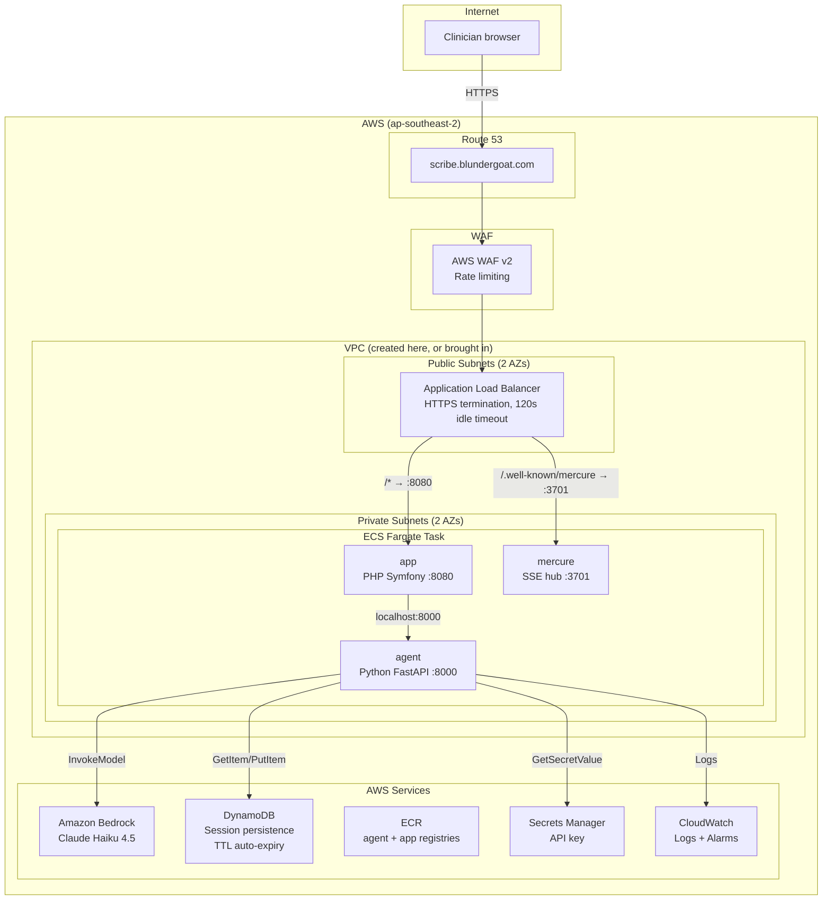
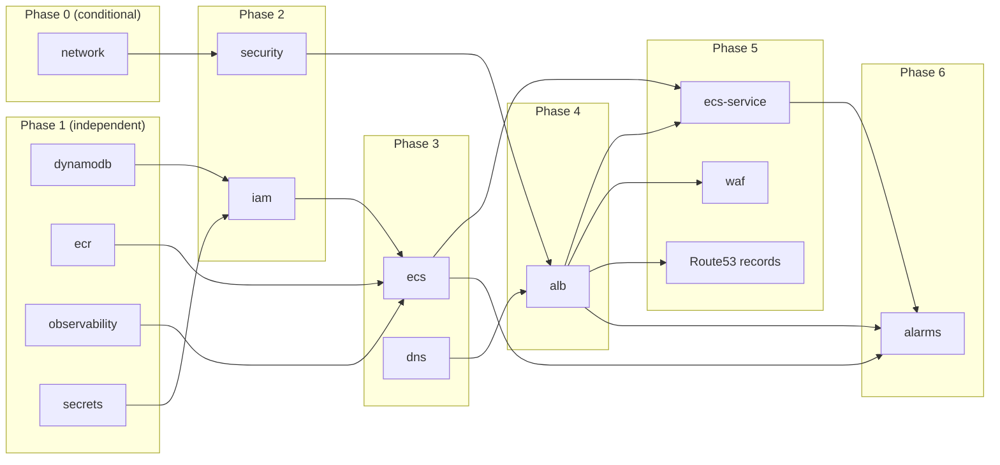

# AWS Infrastructure

Terraform infrastructure that deploys Ambient Scribe to AWS ECS Fargate behind an ALB, serving
`scribe.blundergoat.com` by default. The app, agent, and Mercure hub run as three containers in one
Fargate task and talk to each other over `localhost`.

Two regions are in play and they are deliberately different. The prod AWS provider uses
`var.aws_region` (`ap-southeast-2` by default, matching the AU Bedrock model IDs), while the
Terraform state bucket and lock table live in `us-east-1` and `scripts/terraform.sh` exports
`AWS_DEFAULT_REGION=us-east-1` for backend access.

## Architecture



The ALB has two target groups. The default action forwards `/*` to the app container on 8080, with
its health check on `/`. A listener rule at priority 10 forwards `/.well-known/mercure*` to the
Mercure container on 3701, health-checked on `/healthz`. The agent container is not an ALB target at
all - the app reaches it over `localhost:8000` inside the task.

## File Structure

```
infra/terraform/
├── bootstrap/                    # Run once: S3 state bucket + DynamoDB lock + KMS key
│   ├── main.tf
│   ├── variables.tf
│   ├── outputs.tf
│   └── versions.tf
├── environments/prod/            # Root module orchestrating everything
│   ├── main.tf                   # Module wiring, agent/app/mercure env vars
│   ├── variables.tf              # All configurable settings
│   ├── outputs.tf                # ALB DNS, ECR URLs, cluster name, etc.
│   ├── versions.tf               # Terraform >= 1.5.0, AWS >= 5.0.0 < 6.30.1
│   ├── backend.tf                # S3 backend (partial config)
│   ├── backend.hcl.example       # Backend config template
│   └── terraform.tfvars.example  # Variable values template
└── modules/                      # 13 modules
    ├── network/                  # VPC + subnets, created only when vpc_id is empty
    ├── dynamodb/                 # Session persistence table
    ├── ecr/                      # Container image registry (instantiated twice: agent, app)
    ├── secrets/                  # API key in Secrets Manager
    ├── observability/            # CloudWatch log groups (agent, app, mercure)
    ├── security/                 # ALB + ECS security groups
    ├── iam/                      # Execution role, task role (Bedrock + DynamoDB), GitHub OIDC
    ├── ecs/                      # Cluster + three-container task definition
    ├── dns/                      # Route 53 records + ACM certificate
    ├── alb/                      # Load balancer, target group, listeners
    ├── ecs-service/              # Fargate service with circuit breaker
    ├── waf/                      # Rate limiting
    └── alarms/                   # ALB 5xx, response time, ECS task count
```

## Prerequisites

1. **Terraform >= 1.5.0** and **AWS CLI v2** installed
2. **AWS profile** `aws_devgoat` configured (`aws sso login --profile aws_devgoat`)
3. **Route 53 hosted zone** for `blundergoat.com`, or set `create_hosted_zone = true`

The VPC is created by the `network` module unless you supply `vpc_id`, `public_subnet_ids`, and
`private_subnet_ids` in `terraform.tfvars`. There is no hard dependency on another project's state.

## Setup

### 1. Bootstrap (one-time)

Creates the S3 bucket and DynamoDB table for Terraform remote state.

```bash
./scripts/terraform.sh --bootstrap init
./scripts/terraform.sh --bootstrap apply
```

Defaults are `ambient-scribe-terraform-state-prod` and `ambient-scribe-terraform-locks-prod` in
`us-east-1`.

### 2. Configure

```bash
cd infra/terraform/environments/prod

# Backend config (S3 state)
cp backend.hcl.example backend.hcl
# Edit backend.hcl if you changed bootstrap defaults

# Variable values
cp terraform.tfvars.example terraform.tfvars
# Set hosted_zone_id; optionally switch to a bring-your-own VPC
```

### 3. Deploy

```bash
./scripts/terraform.sh init
./scripts/terraform.sh plan    # Review changes
./scripts/terraform.sh apply   # Create infrastructure
```

### 4. Push images

`./scripts/deploy.sh` builds both images, pushes them to ECR, and forces a new deployment. See
`docs/deployment.md` for what it does step by step.

### 5. Verify

Symfony exposes no `/health` route. `/` is what the ALB health check probes, and `/scribe` is the
application itself:

```bash
curl -sSf https://scribe.blundergoat.com/ >/dev/null && echo "ALB target healthy"
curl -sSf https://scribe.blundergoat.com/scribe >/dev/null && echo "Scribe page served"
```

The agent's own `/health` and `/agent/model-health` endpoints are internal to the task. Reach the
latter through the Symfony proxy at `/agent/model-health`.

## CI/CD

No GitHub Actions deployment workflow is committed in this checkout. The `iam` module still
provisions a GitHub OIDC role so a pipeline can be added without long-lived credentials.

After `terraform apply`, set these in GitHub repo settings (Settings > Secrets and variables >
Actions > Variables):

| Variable | Value | Source |
|----------|-------|--------|
| `AWS_REGION` | `ap-southeast-2` | `var.aws_region` |
| `AWS_ROLE_ARN` | `arn:aws:iam::...` | `./scripts/terraform.sh output github_actions_role_arn` |

## Module Dependency Order



## Container Environment Variables

Set in `locals` in `infra/terraform/environments/prod/main.tf` and injected into the task at
runtime.

**agent container**

| Variable | Value | Source |
|----------|-------|--------|
| `PORT` | `8000` | Hardcoded |
| `ROLE_AGENT_MODEL_PROVIDER` | `bedrock` | Hardcoded |
| `ROLE_AGENT_MODEL_ID` | `au.anthropic.claude-haiku-4-5-20251001-v1:0` | `var.model_id` |
| `SUMMARY_AGENT_MODEL_PROVIDER` | `bedrock` | Hardcoded |
| `SUMMARY_AGENT_MODEL_ID` | `au.anthropic.claude-haiku-4-5-20251001-v1:0` | `var.summary_model_id` |
| `AWS_DEFAULT_REGION` | `ap-southeast-2` | `var.aws_region` |
| `ALLOW_SYSTEM_PROMPT_OVERRIDE` | `false` | Hardcoded |
| `DYNAMODB_TABLE` | table name | `module.dynamodb.table_name` |
| `API_KEY` | (secret) | Secrets Manager via ECS secrets injection |

**app container**

| Variable | Value |
|----------|-------|
| `APP_ENV` / `APP_DEBUG` | `prod` / `0` |
| `APP_SECRET` | generated by `random_password` |
| `AGENT_ENDPOINT` | `http://localhost:8000` (sidecar) |
| `MERCURE_URL` | `http://localhost:3701/.well-known/mercure` |
| `MERCURE_PUBLIC_URL` | `https://scribe.blundergoat.com/.well-known/mercure` |
| `MERCURE_JWT_SECRET` | generated by `random_password`, shared with the mercure container |

**mercure container**

| Variable | Value |
|----------|-------|
| `MERCURE_PUBLISHER_JWT_KEY` / `MERCURE_SUBSCRIBER_JWT_KEY` | the same generated JWT secret |
| `SERVER_NAME` | `:3701` |
| `MERCURE_EXTRA_DIRECTIVES` | `anonymous` + `cors_origins https://scribe.blundergoat.com` |

Anonymous subscription is enabled in this configuration. Adding subscriber authentication is a
separate decision and is not settled here.

## terraform.sh Commands

```bash
./scripts/terraform.sh init          # Initialize with backend config
./scripts/terraform.sh plan          # Preview changes
./scripts/terraform.sh apply         # Apply changes
./scripts/terraform.sh apply -y      # Apply without confirmation
./scripts/terraform.sh destroy       # Destroy all resources
./scripts/terraform.sh output        # Show outputs
./scripts/terraform.sh validate      # Validate config
./scripts/terraform.sh fmt           # Format all .tf files
./scripts/terraform.sh state list    # List state resources
./scripts/terraform.sh --bootstrap init   # Bootstrap state bucket
./scripts/terraform.sh --bootstrap apply  # Create state bucket
```

## Outputs

`./scripts/terraform.sh output` exposes `alb_dns_name`, `ecr_agent_repository_url`,
`ecr_app_repository_url`, `api_key_secret_name`, `ecs_cluster_name`, `agent_task_definition_arn`,
`hosted_zone_id`, `ecs_security_group_id`, `github_actions_role_arn`, `dynamodb_table_name`,
`agent_url`, `vpc_id`, `public_subnet_ids`, and `private_subnet_ids`.

## Cost Notes

This configuration has never been costed against a running deployment. The load-bearing drivers are
the ALB, one always-on Fargate task at 1024 CPU / 2048 MB, WAF, and a NAT gateway when the `network`
module creates the VPC - `enable_nat_gateway` and `single_nat_gateway` both default to `true`, and
that variable's own description estimates ~$32/month for the single gateway. DynamoDB, ECR, and
CloudWatch are small by comparison. Price these against the AWS calculator for your region before
committing to a budget.
