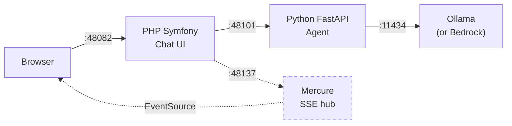
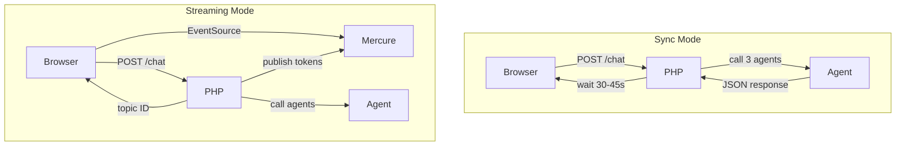

# Local Development Guide

> **Note:** This guide is partially inherited from ambient-scribe and is being updated for ambient-scribe. The Docker Compose section reflects the new NeMo-based architecture. Some bare-metal instructions are still Summit-specific and will be rewritten.

Two ways to run Ambient Scribe locally: **Docker Compose** (everything containerised, requires NVIDIA GPU) or **bare-metal** (PHP and Python running directly on your machine).

## Quick Start

### Option A: Docker Compose (recommended for first run)

Everything runs in containers. No local PHP/Python install needed.

```bash
cp .env.example .env
docker compose up --build
# Open http://localhost:48082
```

First run builds the NeMo image and warms large model layers — this can take a while.

### Option B: Bare-metal (recommended for development)

Runs PHP and Python directly. Faster iteration, no container rebuilds.

```bash
./scripts/setup-initial.sh    # Install all dependencies
./scripts/start-dev.sh        # Start PHP + Python + Ollama
# Open http://localhost:48082
```

## Prerequisites

### For Docker Compose

- Docker and Docker Compose
- ~12GB free disk space (LLM models)

### For bare-metal

- PHP 8.2+
- Composer
- Python 3.12+
- pip3
- Ollama installed locally (https://ollama.com)
- The `strands-php-client` repo cloned as a sibling directory:

```
projects/
├── ambient-scribe/         # This repo
└── strands-php-client/        # Required — local Composer path dependency
```

## Architecture

Both modes run the same core services:



Mercure is optional (Docker Compose only) — without it, the app falls back to sync mode.

### Docker Compose mode

3 containers with automatic dependency ordering (+ 1 optional):

| Service | Image | Port | Purpose |
|---------|-------|------|---------|
| **nemo-agent** | Built from `docker/nemo/Dockerfile` | 48101 → 8000 | Python FastAPI agent with NeMo inference |
| **mercure** | dunglas/mercure | 48137 → 3701 | Real-time SSE hub for streaming mode |
| **app** | Built from `Dockerfile` | 48082 → 8080 | PHP Symfony scribe UI |
| **ollama** *(optional)* | ollama/ollama | 11434 → 11434 | Local LLM for role inference (CPU-only) |

Startup order: nemo-agent → mercure → app. The ollama service is opt-in via the `local` profile (`docker compose --profile local up`).

Containers talk via Docker networking (e.g. `http://nemo-agent:8000`, `http://mercure:3701`).
If `ROLE_AGENT_MODEL_PROVIDER=ollama`, the agent reaches Ollama via `OLLAMA_HOST`:
- Host-installed Ollama (default): `http://host.docker.internal:11434`
- Docker Compose Ollama (profile): `http://ollama:11434`

### Bare-metal mode

4 local services managed by `start-dev.sh`:

| Service | Port | What runs |
|---------|------|-----------|
| **Ollama** | 11434 | `ollama serve` (started automatically if not running) |
| **NeMo agent** | 48101 | Docker Compose service exposing FastAPI on host port 48101 |
| **Mercure** | 48137 | Docker Compose service exposing the SSE hub on host port 48137 |
| **PHP app** | 48082 | `php -S 0.0.0.0:48082 -t public` |

Services talk via `localhost`, and `start-dev.sh` keeps the streaming path available by starting the agent and Mercure containers alongside the local PHP server.

## Environment Configuration

All config lives in `.env`. Docker Compose and bare-metal both read from it.

```bash
cp .env.example .env
```

### Choosing a model provider

#### Ollama (default — local, free)

No credentials needed. The model runs on your machine.

```env
ROLE_AGENT_MODEL_PROVIDER=ollama
ROLE_AGENT_OLLAMA_MODEL=qwen2.5:14b
```

#### AWS Bedrock (cloud)

Uses cloud-hosted models. Requires AWS credentials.

```env
ROLE_AGENT_MODEL_PROVIDER=bedrock
AWS_ACCESS_KEY_ID=your-access-key-id
AWS_SECRET_ACCESS_KEY=your-secret-access-key
AWS_SESSION_TOKEN=              # Only if using temporary credentials
AWS_DEFAULT_REGION=ap-southeast-2
ROLE_AGENT_MODEL_ID=us.anthropic.claude-sonnet-4-20250514-v1:0
```

### Ollama Setup

Ollama provides local LLM inference for role attribution (DOCTOR/PATIENT). The GPU is reserved for NeMo transcription, so Ollama always runs on CPU.

#### Option A: Install Ollama natively (recommended for bare-metal dev)

Install from https://ollama.com, then pull the recommended model:

```bash
ollama pull qwen2.5:14b
```

`start-dev.sh` auto-starts Ollama if the binary is installed but the server is not running.

#### Option B: Use the Docker Compose profile

An optional Ollama service is included in `docker-compose.yml` via the `local` profile:

```bash
docker compose --profile local up
```

This starts Ollama alongside the main stack. When using this, set `OLLAMA_HOST` so the nemo-agent container can reach it:

```env
OLLAMA_HOST=http://ollama:11434
```

#### Expected CPU inference latency

| Model | RAM needed | Inference time (CPU, 64GB RAM) |
|-------|-----------|-------------------------------|
| `qwen2.5:7b` | ~8GB | ~15s per role inference |
| `qwen2.5:14b` | ~16GB | ~30s per role inference |

These are role attribution calls (short prompts), not full conversations. The latency is acceptable because role inference runs asynchronously — transcript segments appear immediately, and DOCTOR/PATIENT labels update a few seconds later.

### Changing the Ollama model

Edit `.env`:

```env
ROLE_AGENT_OLLAMA_MODEL=mistral
```

Good options: `qwen2.5:14b` (default, 9GB), `qwen2.5:7b` (5GB), `mistral` (4GB), `llama3.1` (4.7GB).

Smaller models are faster but produce lower quality role attribution. The 14b model is a good balance for machines with 16GB+ RAM.

**For Docker Compose**: restart to pull the new model:

```bash
docker compose down
docker compose up
```

**For bare-metal**: the start script pulls automatically:

```bash
# Either set in .env and restart, or override inline:
ROLE_AGENT_OLLAMA_MODEL=mistral ./scripts/start-dev.sh
```

**To pull a model manually**:

```bash
ollama pull qwen2.5:14b
```

### Other environment variables

These are set automatically by `start-dev.sh` and `docker-compose.yml`. You typically don't need to change them:

| Variable | Docker value | Bare-metal value | Purpose |
|----------|-------------|-----------------|---------|
| `AGENT_ENDPOINT` | `http://nemo-agent:8000` | `http://localhost:48101` | PHP → Python agent URL |
| `OLLAMA_HOST` | `http://host.docker.internal:11434` | `http://localhost:11434` | Python agent → Ollama URL |
| `MERCURE_URL` | `http://mercure:3701/...` | *(empty)* | PHP → Mercure publish URL |
| `MERCURE_PUBLIC_URL` | `http://localhost:48137/...` | *(empty)* | Browser → Mercure subscribe URL |
| `MERCURE_JWT_SECRET` | `ambient-scribe-mercure-secret` | *(empty)* | JWT signing for Mercure |
| `APP_SECRET` | `ambient-scribe-dev-secret-change-me` | same | Symfony CSRF/session secret |

## Scripts Reference

All scripts are in the `scripts/` directory.

### Setup

| Script | Purpose |
|--------|---------|
| `setup-initial.sh` | First-time setup: checks prerequisites, copies `.env`, runs `composer install`, creates Python venv, installs pip dependencies |
| `setup-verify.sh` | Verifies the environment: system tools, project files, PHP/Python dependencies, dev tools, runs PHPUnit + PHPStan + CS check |

### Running

| Script | Purpose |
|--------|---------|
| `start-dev.sh` | Starts Docker Compose stack (nemo-agent + app + Mercure). Press Ctrl+C to stop. |
| `health-checks.sh` | Read-only diagnostics: Docker, GPU, containers, services, config, connectivity |

### Dependencies

| Script | Purpose |
|--------|---------|
| `dependencies-install.sh [--php] [--python]` | Install from lock files (exact versions) |
| `dependencies-update.sh [--php] [--python]` | Update to latest versions within constraints, runs security audit and smoke tests |

### Quality

| Script | Purpose |
|--------|---------|
| `preflight-checks.sh` | All 12 quality gates: composer validate, security audit, code style, complexity, PHPMD, PHPStan, Twig lint, Python syntax, Docker config, tests, coverage, mutation testing |
| `preflight-checks.sh --mutate` | Include Infection mutation testing (adds ~2-5s) |
| `preflight-checks.sh --coverage-min=90` | Override minimum coverage threshold (default 80%) |

## Sync vs Streaming Mode

The app supports two modes for receiving agent responses:



### Sync mode (both Docker and bare-metal)

The browser sends a request to `/chat` and waits for all three agents to respond sequentially. Takes ~30-45 seconds depending on the model and hardware. Simple and reliable.

### Streaming mode (Docker Compose only)

Requires Mercure. The browser gets an immediate response with a Mercure topic, subscribes via EventSource (SSE), and receives tokens in real-time as each agent generates them. Word-by-word output like ChatGPT.

Streaming is automatically enabled when Mercure is available (Docker Compose) and disabled when it's not (bare-metal).

## Troubleshooting

### "strands-php-client not found"

The PHP app depends on the `strands-php-client` package via a Composer path repository. Clone it as a sibling directory:

```bash
cd ..
git clone https://github.com/blundergoat/strands-php-client.git
cd ambient-scribe
composer install
```

### "Address already in use" on start

Another process is using port 48101, 48082, or 48137. Check what's running:

```bash
./scripts/health-checks.sh    # Shows container state + service health
```

Or override the ports:

```bash
AGENT_PORT=58101 APP_PORT=58082 MERCURE_PORT=58137 ./scripts/start-dev.sh
```

### Ollama model is slow

- Check if you have GPU acceleration: `ollama ps` shows if the model is using GPU
- Try a smaller model: `OLLAMA_MODEL=mistral ./scripts/start-dev.sh`
- CPU-only inference for 14B models takes 30-60 seconds per agent response

### Docker build fails at "strands-php-client"

The `docker-compose.yml` uses `additional_contexts` to access the sibling directory. Make sure the directory exists:

```bash
ls ../strands-php-client/composer.json    # Should exist
docker compose up --build
```

### Agent returns errors about model not found

The Ollama model hasn't been pulled yet:

```bash
# Check what models are available
ollama list

# Pull the configured model
ollama pull qwen2.5:14b
```

### Python agent won't start (bare-metal)

Check the venv exists and has dependencies:

```bash
./scripts/setup-verify.sh    # Checks everything
# Or manually:
strands_agents/.venv/bin/python -c "import strands; import fastapi"
```
