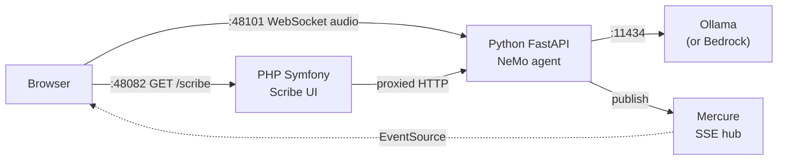

# Local Development Guide

Both ways to run Ambient Scribe locally use the same Docker Compose services and require an NVIDIA
GPU. The difference is how much the tooling does for you: raw `docker compose`, or the guided
`start-dev.sh` entry point.

The `app` container bind-mounts the repository at `/app`, so PHP, Twig, and JS edits take effect
without rebuilding the image either way.

## Quick Start

### Option A: Raw Docker Compose (fine for a first look)

```bash
cp .env.example .env
docker compose up --build
# Open http://localhost:48082
```

First run builds the NeMo image and warms large model layers - this can take a while.

### Option B: start-dev.sh (recommended for development)

`start-dev.sh` brings up the same containers with `docker compose up -d`, then does the things raw
Compose does not: selects the streaming transcription engine, activates the `ollama` profile when
that provider is chosen, restores the pinned post-visit correction checkpoint, and runs health
checks before printing `Ready!`.

```bash
./scripts/setup-initial.sh    # Install dependencies for local tooling
./scripts/start-dev.sh        # Start the stack with health checks
# Open http://localhost:48082/scribe
```

## Prerequisites

### To run the app

- Docker and Docker Compose
- NVIDIA GPU with the Container Toolkit
- ~12GB free disk space (speech models)

### To run the local tooling

Composer, PHPUnit, PHPStan, and pytest run on the host, so `setup-initial.sh` also needs:

- PHP 8.3+ and Composer
- Python 3.12+ and pip3

`blundergoat/strands-php-client` installs through Composer like any other
dependency (`composer.lock` pins a `dev-dev` commit); no sibling checkout is
needed.

## Architecture

Both modes run the same core services:



Mercure is required: live transcript, role, and summary events reach the browser
only through it, so both run modes start the Mercure container.

### Services

3 containers with automatic dependency ordering (+ 1 optional):

| Service | Image | Port | Purpose |
|---------|-------|------|---------|
| **nemo-agent** | Built from `docker/nemo/Dockerfile` | 48101 → 8000 | Python FastAPI agent with NeMo inference |
| **mercure** | dunglas/mercure | 48137 → 3701 | Real-time SSE hub for streaming mode |
| **app** | Built from `Dockerfile` | 48082 → 8080 | PHP Symfony scribe UI |
| **ollama** *(optional)* | ollama/ollama | no host port (in-network only) | Local LLM for role inference + summaries (CPU-only) |

Startup order: nemo-agent → mercure → app. The ollama service is opt-in via the `ollama` profile (`COMPOSE_PROFILES=ollama docker compose up`, or let `start-dev.sh` activate it when `ROLE_AGENT_MODEL_PROVIDER=ollama`).

Containers talk via Docker networking (e.g. `http://nemo-agent:8000`, `http://mercure:3701`).
The agent container's `OLLAMA_HOST` is pinned to the bundled service at
`http://ollama:11434` in `docker-compose.yml` and cannot be overridden from
`.env` (`host.docker.internal` is unreachable from the agent container on some
Docker/WSL2 setups). To use a cloud model instead, set
`ROLE_AGENT_MODEL_PROVIDER=bedrock`.

### Reading nemo-agent logs

The `nemo-agent` container emits JSON logs by default so a replay or live visit can be traced by
session. Use `--no-log-prefix` so Docker does not prepend service names before the JSON line:

```bash
docker compose logs --no-log-prefix nemo-agent --since 10m \
  | jq -r 'select(.session_id == "SESSION_ID") | [.ts, .level, .event] | @tsv'
```

Useful checks while debugging a clinician session:

```bash
# Chunk cadence and inference timing for one recording.
docker compose logs --no-log-prefix nemo-agent --since 10m \
  | jq -r 'select(.session_id == "SESSION_ID" and .event == "websocket.chunk_e2e")
    | [.chunk_count, .inference_ms, .total_ms, .segments] | @tsv'

# Any server-side errors, with type and message visible without extra instrumentation.
docker compose logs --no-log-prefix nemo-agent --since 10m \
  | jq -r 'select(.level == "error") | [.ts, .event, .session_id, .error_type, .error] | @tsv'

# Mercure delivery outcomes for transcript, role, and summary events.
docker compose logs --no-log-prefix nemo-agent --since 10m \
  | jq -r 'select(.event | startswith("mercure.publish."))
    | [.ts, .event, .session_id, .topic, .duration_ms] | @tsv'
```

For short interactive debugging without JSON parsing, opt back into plain lines:

```bash
LOG_FORMAT=console docker compose up -d --force-recreate nemo-agent
```

### What start-dev.sh adds

`start-dev.sh` runs `docker compose up -d` - the same three services, plus `ollama` when
`ROLE_AGENT_MODEL_PROVIDER=ollama` sets `COMPOSE_PROFILES=ollama` - and wraps it with:

| Step | What it does |
|------|--------------|
| Engine selection | Exports `NEMO_SESSION_ENGINE=streaming` (override with `windowed` for A/B comparisons) |
| Provider checks | Validates AWS credentials for Bedrock, or pulls the model into the compose `ollama` service |
| Correction checkpoint | Restores the pinned post-visit ASR checkpoint before printing `Ready!`, failing closed if it cannot load |
| Health checks | Probes each service before reporting the stack ready |
| Port selection | Exposes the agent on the first free port in 48101-48110 |

It then streams container logs. `Ctrl+C` runs the script's cleanup trap, which stops the
containers but leaves them in place for a fast restart; `docker compose down` removes them.

## Environment Configuration

All config lives in `.env`. Both run modes read from it.

```bash
cp .env.example .env
```

### Choosing a model provider

#### Ollama (local, free)

No credentials needed. The model runs on your machine. (The checked-in
`.env.example` selects Bedrock; switch this line to go local.)

```env
ROLE_AGENT_MODEL_PROVIDER=ollama
ROLE_AGENT_OLLAMA_MODEL=qwen3.5:9b
```

#### AWS Bedrock (cloud - the `.env.example` default)

Uses cloud-hosted models. Requires AWS credentials.

```env
ROLE_AGENT_MODEL_PROVIDER=bedrock
AWS_ACCESS_KEY_ID=your-access-key-id
AWS_SECRET_ACCESS_KEY=your-secret-access-key
AWS_SESSION_TOKEN=              # Only if using temporary credentials
AWS_DEFAULT_REGION=ap-southeast-2
ROLE_AGENT_MODEL_ID=au.anthropic.claude-haiku-4-5-20251001-v1:0
```

### Ollama Setup

Ollama provides local LLM inference for medical role attribution. The GPU is reserved for NeMo transcription, so Ollama always runs on CPU.

The agent container reaches Ollama only in-network at `http://ollama:11434`, so the containerised
stack always uses the Compose service. A host-installed Ollama is reachable only when you run
FastAPI outside Docker.

#### Option A: Use the Docker Compose profile (what start-dev.sh does)

An optional Ollama service is included in `docker-compose.yml` via the `ollama` profile:

```bash
COMPOSE_PROFILES=ollama docker compose up
```

This starts Ollama alongside the main stack; the nemo-agent container reaches it
automatically (its `OLLAMA_HOST` is pinned to `http://ollama:11434` in Compose).
On first run, pull the model into the persistent `ollama_data` volume:

```bash
docker compose exec ollama ollama pull qwen3.5:9b
```

`start-dev.sh` does this pull for you when the model is missing.

#### Option B: Install Ollama natively

Only useful when running FastAPI outside Docker. Install from https://ollama.com, then:

```bash
ollama pull qwen3.5:9b
```

`scripts/install-ollama.sh` is the host-side setup path: it defaults to `qwen3.5:9b`, never edits
`.env`, and starts new servers with GPU visibility disabled so NeMo keeps the only GPU.

### Post-visit correction model

`./scripts/start-dev.sh` restores the pinned correction checkpoint before it prints `Ready!`, so a
replaced data volume does not silently cost you the reviewed transcript. The first run after the
volume is emptied downloads about 2.5 GB; later runs only re-verify it, which takes a second or two.

The checkpoint lives in the `session_data` volume at `/data/post_visit_model_cache`, not in the
image. That volume also holds `sessions.db`, so `docker compose down -v` removes your stored visits
and the correction model together. Removing just the model is safe:

```bash
docker compose exec nemo-agent rm -rf -- /data/post_visit_model_cache/models--nvidia--parakeet-unified-en-0.6b
```

Startup fails closed if the checkpoint cannot be restored or cannot be loaded by the installed NeMo.
It leaves the containers running, because live transcription still works and you need the stack up
to fix it. Deployment packaging for this checkpoint is a separate decision and is not settled here.

#### Expected CPU inference latency

| Model | RAM needed | Notes |
|-------|-----------|-------|
| `qwen3.5:9b` | ~8GB | default local demo model |
| `qwen2.5:7b` | ~8GB | faster, lower quality fallback |

These are role attribution calls (short prompts), not full conversations. The latency is acceptable because role inference runs asynchronously - transcript segments appear immediately, and Doctor/Patient labels update after role inference completes (tens of seconds per call on CPU with the 9B default).

### Changing the Ollama model

Edit `.env`:

```env
ROLE_AGENT_OLLAMA_MODEL=mistral
```

Good options: `qwen3.5:9b` (default), `qwen2.5:7b` (5GB), `mistral` (4GB), `llama3.1` (4.7GB).

Smaller models are faster but produce lower quality role attribution. The 9b default is a good balance for the local demo app.

**For Docker Compose**: pull the new model into the running ollama service:

```bash
docker compose exec ollama ollama pull mistral
```

**Via start-dev.sh**: the start script pulls the configured model automatically:

```bash
# Either set in .env and restart, or override inline:
ROLE_AGENT_OLLAMA_MODEL=mistral ./scripts/start-dev.sh
```

**To pull a model manually**:

```bash
ollama pull qwen3.5:9b
```

### Other environment variables

These are set automatically by `start-dev.sh` and `docker-compose.yml`. You typically don't need to change them:

| Variable | In-container value | Value when a service runs on the host | Purpose |
|----------|--------------------|----------------------------------------|---------|
| `AGENT_ENDPOINT` | `http://nemo-agent:8000` | `http://localhost:48101` | PHP → Python agent URL |
| `OLLAMA_HOST` | `http://ollama:11434` (pinned in Compose) | `http://localhost:11434` | Python agent → Ollama URL |
| `MERCURE_URL` | `http://mercure:3701/...` | `http://localhost:48137/...` | Internal Mercure publish URL |
| `MERCURE_PUBLIC_URL` | `http://localhost:48137/...` | `http://localhost:48137/...` | Browser → Mercure subscribe URL |
| `MERCURE_JWT_SECRET` | `changemechangemechangemechangeme` | same placeholder | JWT signing for Mercure; replace outside local dev |
| `APP_SECRET` | `changeme` | same placeholder | Symfony CSRF/session secret; replace outside local dev |

## Scripts Reference

All scripts are in the `scripts/` directory.

### Setup

| Script | Purpose |
|--------|---------|
| `setup-initial.sh` | First-time setup: checks prerequisites, copies `.env`, runs `composer install`, creates Python venv, installs pip dependencies |
| `setup-verify.sh` | Verifies the environment: system tools, project files, PHP/Python dependencies, dev tools, runs PHPUnit + PHPStan + CS check |

### Running

| Script | Purpose |
|--------|---------|
| `start-dev.sh` | Starts the Compose stack (nemo-agent + app + Mercure, plus ollama when selected) with engine selection, checkpoint restore, and health checks. Press Ctrl+C to stop the containers. |
| `health-checks.sh` | Read-only diagnostics: Docker, GPU, containers, services, config, connectivity |

### Dependencies

| Script | Purpose |
|--------|---------|
| `dependencies-install.sh [--php] [--python]` | Install from lock files (exact versions) |
| `dependencies-update.sh [--php] [--python]` | Update to latest versions within constraints, runs security audit and smoke tests |

### Quality

| Script | Purpose |
|--------|---------|
| `preflight-checks.sh` | All 12 quality gates: composer validate, security audit, danger policy (repo diff), code style (PHP-CS-Fixer), PHP quality (gruff-php), PHPMD, PHPStan L10, Twig lint, Python lint (Ruff), Docker Compose config, PHPUnit tests, coverage |
| `preflight-checks.sh --mutate` | Add the optional 13th gate: Infection mutation testing |
| `preflight-checks.sh --coverage-min=90` | Override minimum coverage threshold (default 80%) |

## Live Event Delivery

All transcript delivery is streaming: the browser sends PCM audio over the
FastAPI WebSocket, and raw segments, role updates, and summaries come back as
Mercure SSE events on `scribe/session/{id}/{raw|roles|summary}`. There is no
synchronous fallback mode - both run modes start the Mercure container. Summary and correction requests are same-origin Symfony
POSTs (`/session/{id}/correction`, then `/session/{id}/summary`) that Symfony
proxies to FastAPI; the summary also arrives as a Mercure event.

## Troubleshooting

### "strands-php-client not found"

The PHP app depends on `blundergoat/strands-php-client` at a pinned `dev-dev`
commit (see `composer.json`). A plain install fetches it - no sibling checkout
is involved:

```bash
composer install
```

If Composer refuses the `dev-dev` constraint, make sure you are installing from
the repo root so the committed `composer.lock` is used.

### "Address already in use" on start

Another process is using port 48101, 48082, or 48137. Check what's running:

```bash
./scripts/health-checks.sh    # Shows container state + service health
```

Or override the ports:

```bash
AGENT_PORT=58101 APP_PORT=58082 MERCURE_PORT=58137 ./scripts/start-dev.sh
```

### Ollama model is slow

- Remember the GPU is reserved for NeMo: Ollama runs CPU-only here by design
- Try a smaller model: `ROLE_AGENT_OLLAMA_MODEL=mistral ./scripts/start-dev.sh`
- CPU-only inference for the 9B default can take tens of seconds per call; role
  labels arrive asynchronously so the transcript itself is not delayed

### Agent returns errors about model not found

The Ollama model hasn't been pulled yet:

```bash
# Check what models are available
ollama list

# Pull the configured model
ollama pull qwen3.5:9b
```

### Python tooling won't run on the host

Check the venv exists and has dependencies:

```bash
./scripts/setup-verify.sh    # Checks everything
# Or manually:
strands_agents/.venv/bin/python -c "import strands; import fastapi"
```
