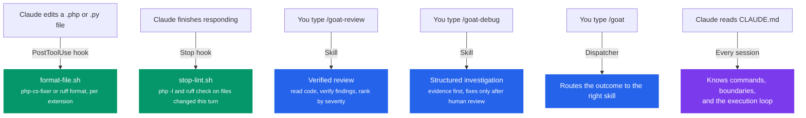

# Claude Code Workflow Configuration

This project ships a tuned [Claude Code](https://claude.ai/code) setup: an instruction file that
carries the project's rules, two shell hooks that format and lint automatically, and a set of
workflow skills that give repeatable jobs a fixed protocol. This document explains what each piece
does, why it exists, and how to adapt the pattern for your own projects.

## File Layout

```
.claude/
├── settings.json                  # Permissions + hooks (committed)
├── settings.local.json            # Local permission overrides (gitignored)
├── hooks/
│   ├── format-file.sh             # PostToolUse - format the file that was just edited
│   └── stop-lint.sh               # Stop - lint the files changed this turn
├── profiles/                      # Lane-scoped context bundles
│   ├── infrastructure.json
│   ├── php-backend.json
│   └── python-agent.json
└── skills/                        # Workflow skills, invoked as /<name>
    ├── goat/                      # Dispatcher - picks the right workflow for an outcome
    ├── goat-plan/                 # Task breakdown with milestone tracking
    ├── goat-debug/                # Structured investigation before any fix
    ├── goat-review/               # Diff, PR, and area review
    ├── goat-qa/                   # Coverage gaps and test strategy
    ├── goat-security/             # Security implications of a change
    ├── goat-critique/             # Multi-lens critique before shipping
    └── goat-clarity/              # Comments, docs, naming, private placement
CLAUDE.md                          # Project context + workflow rules
AGENTS.md                          # The same rules, for agents that read AGENTS.md
.github/copilot-instructions.md    # The same rules, for Copilot
```

`.goat-flow/` holds what the instruction files route to: architecture and code-map references, the
glossary, tool playbooks, and the learning loop.

## How It All Fits Together



## CLAUDE.md - Project Context

Claude Code reads `CLAUDE.md` at the start of every session. `AGENTS.md` and
`.github/copilot-instructions.md` carry the same rules for other agents, and the three are checked
for parity.

The file is organised as behavioural rules rather than prose, because everything in it competes for
the same context budget:

- **Truth Order** - which source wins when two disagree, from the user's instruction down to peer
  agent files.
- **Autonomy Tiers** - Always / Ask First / Never. Reading and focused checks are always allowed;
  PHP-to-Python contract changes, WebSocket topics, audio format, and GPU concurrency need approval;
  committing, pushing, and weakening tests are never allowed.
- **Hard Rules** - severity order, "read every file you change", cite file evidence with semantic
  anchors rather than line numbers.
- **Execution Loop** - READ, SCOPE, ACT, VERIFY, with a read and turn budget per complexity class.
- **Definition of Done** - what has to be true before a task is reported complete.
- **Router Table** - where to look for architecture, the code map, playbooks, and each lane.

### Why the rules look like this

Each one addresses a failure mode that showed up in real sessions.

#### Read before diagnosing

`MUST gather evidence from real files before claims or edits; never fabricate repo facts.`

Without it, an agent pattern-matches on class names and env vars instead of tracing the code path,
which produces confident wrong diagnoses - a CORS problem read as a CSP problem because the
symptoms rhyme.

#### Read both sides of a boundary

`Cross-boundary work MUST read both sides first.`

This is a full-stack project where PHP, Python, Twig, Docker, and Mercure are tightly coupled. A
change to a Pydantic model breaks the PHP client; a new Symfony config key needs a matching Compose
variable. Naming the boundaries explicitly is what stops half-finished features.

#### Cite anchors, not line numbers

`Cite file evidence with semantic anchors; do not invent line references.`

Line numbers rot on the next edit and are easy to hallucinate. A searchable anchor - a function
name, a unique string - still resolves months later.

#### Prove it before claiming it

`Do not claim checks passed without the literal pass/fail line from this session.`

The instruction file lists the rationalisations that precede a false completion claim ("should work
now", "linter passed", "sub-agent said success") so they can be named and rejected rather than
argued.

#### No unrequested scope

`No features, abstractions, dependencies, or error handling beyond the declared scope.`

Scope creep is the most expensive thing an agent does unsupervised, because every extra file is one
more thing to review.

## Hooks - Automatic Quality Gates

Hooks are defined in `.claude/settings.json` and fire on specific events. Both project hooks are
shell scripts under `.claude/hooks/`, which keeps the settings file readable and makes the hooks
testable on their own.

### PostToolUse: format the file that changed

```json
{
  "matcher": "Edit|Write",
  "hooks": [
    {
      "type": "command",
      "command": "bash \"$(git rev-parse --show-toplevel)/.claude/hooks/format-file.sh\""
    }
  ]
}
```

**Event:** after every `Edit` or `Write`. Ten edits in one turn means ten runs.

**What it does:** `format-file.sh` switches on the file extension - `vendor/bin/php-cs-fixer fix
--quiet` for `.php`, `ruff format --quiet` for `.py` - and silently does nothing for anything else.
Missing tools are skipped rather than treated as errors, and the script always exits 0.

**Why PostToolUse:** formatting is sub-second and idempotent, so running it per file keeps style
drift from ever accumulating.

**Adapting for other stacks:** add a branch to the script's `case "$FILE_PATH" in` block. It already
carries a commented-out `prettier` branch as the worked example.

### Stop: lint what this turn touched

```json
{
  "hooks": [
    {
      "type": "command",
      "command": "bash \"$(git rev-parse --show-toplevel)/.claude/hooks/stop-lint.sh\""
    }
  ]
}
```

**Event:** once when Claude finishes a full response, however many tool calls it made.

**What it does:** `stop-lint.sh` reads `git diff --name-only HEAD`, then runs `php -l` on each
changed PHP file and `ruff check` on each changed Python file, preferring a `ruff` on `PATH` and
falling back to `strands_agents/.venv/bin/ruff`. Findings go to stderr as information, not
instructions.

Two details are load-bearing:

- **It always exits 0.** A non-zero Stop hook feeds the failure back to the model, which tries to
  fix it, which fires the hook again. Exiting 0 keeps errors visible without the loop.
- **`STOP_HOOK_ACTIVE` guards re-entry.** The same protection, one layer down.

**Why Stop rather than PostToolUse:** analysis is slower and only meaningful once the turn's edits
are all in place. Scoping it to changed files keeps it to a couple of seconds instead of a
whole-project pass.

## Skills - Repeatable Workflows

Skills are markdown protocols in `.claude/skills/<name>/SKILL.md`, invoked by typing `/<name>`.
Each one fixes the shape of a job that is otherwise done differently every time.

| Skill | Use it when |
|-------|-------------|
| `/goat` | You can describe the outcome but not which workflow fits. It routes. |
| `/goat-plan` | Starting non-trivial implementation that needs milestones and progress tracking. |
| `/goat-debug` | Diagnosing a bug or unfamiliar code. Evidence first; fixes wait for human review. |
| `/goat-review` | Reviewing a diff, PR, or codebase area for quality issues. |
| `/goat-qa` | Assessing coverage gaps, test strategy, or testing risk. |
| `/goat-security` | Assessing the security implications of a change or feature. |
| `/goat-critique` | Pressure-testing a decision or analysis before shipping it. |
| `/goat-clarity` | Improving comments, documentation, naming, or private placement. |

**Why a skill instead of just asking?** Three properties are hard to get from a prompt:

1. **A scope freeze.** Several skills declare the files they may change before the first edit, so
   scope creep becomes visible rather than incremental.
2. **A verification gate.** The protocol names what proof is required, which is harder to skip than
   an intention.
3. **A blocking human gate.** `/goat-debug` stops between diagnosis and fix; `/goat-clarity` stops
   before widening its own authority. Neither can be waved through by an agent working alone.

The report-only skills - `/goat-review`, `/goat-qa`, `/goat-security`, `/goat-critique` - do not
edit files unless you separately ask them to.

## Adapting This Setup for Your Project

### Minimum viable setup

1. **An instruction file** with your build commands, architecture sketch, and the boundaries an
   agent must not cross unasked.
2. **A PostToolUse hook** for formatting.
3. **A Stop hook** for linting changed files - remembering to exit 0.

```json
{
  "hooks": {
    "PostToolUse": [
      {
        "matcher": "Edit|Write",
        "hooks": [
          { "type": "command", "command": "bash .claude/hooks/format-file.sh" }
        ]
      }
    ],
    "Stop": [
      {
        "hooks": [
          { "type": "command", "command": "bash .claude/hooks/stop-lint.sh" }
        ]
      }
    ]
  }
}
```

### For other languages

The pattern holds: fast formatting per file, slower analysis once per response.

| Language | PostToolUse (per file) | Stop (per response) |
|----------|------------------------|---------------------|
| PHP | `php-cs-fixer fix` | `php -l`, `phpstan analyse` |
| Python | `ruff format` | `ruff check`, `mypy` |
| TypeScript | `prettier --write` | `tsc --noEmit` |
| Go | `gofmt -w` | `go vet ./...` |
| Rust | `rustfmt` | `cargo check` |

### Denying dangerous operations

`.claude/settings.json` also carries a `permissions.deny` list. It blocks `git commit` and
`git push` outright - commits stay a human action here - along with reads of `.env` files,
credentials, keys, and cloud config directories, and shell patterns such as `sudo`, `mkfs`,
`dd if=`, and `git reset --hard`.

Treat this as one layer, not the whole defence. The instruction file's Never tier is prose; the deny
list mechanically enforces only the subset it can pattern-match.

### Adding a skill

Create a directory under `.claude/skills/` and write the protocol in its `SKILL.md`. The directory
name is the invocation name, so `.claude/skills/my-skill/SKILL.md` becomes `/my-skill`. Give it a
`description` in the frontmatter that says *when* to use it - that is what the model matches
against.
